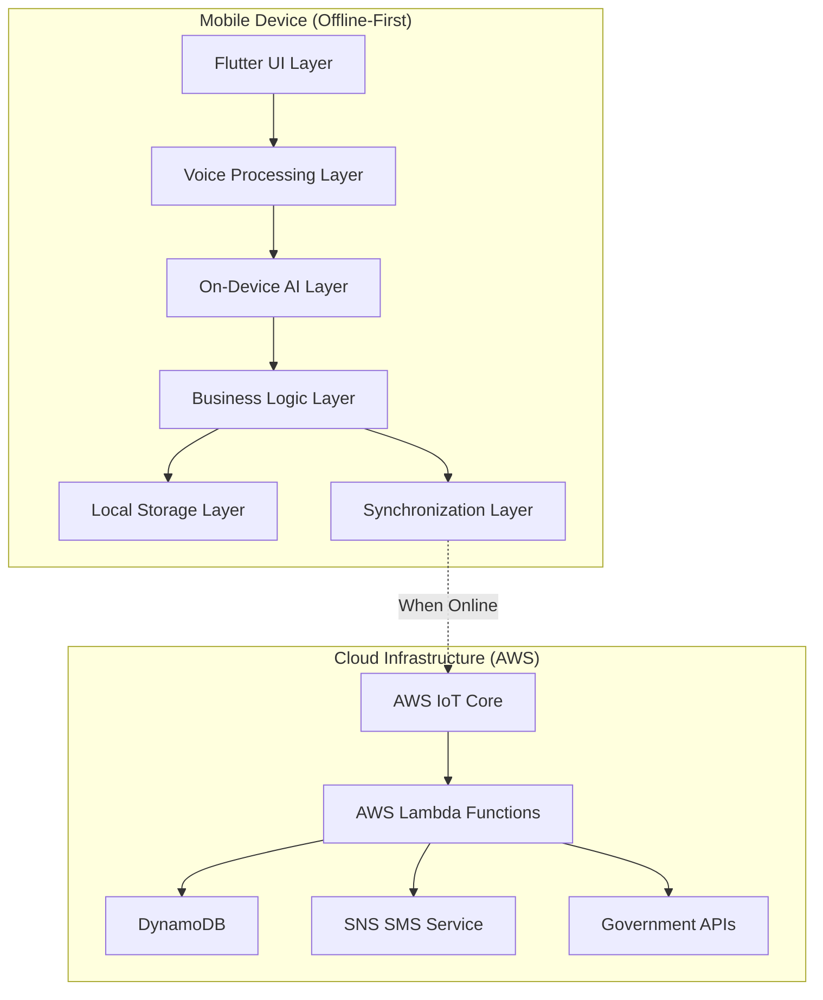

# Design Document: PrajaSeva AI

## Overview

PrajaSeva AI is an offline-first, voice-based AI assistant designed to bridge the digital divide in rural India. The system employs a hybrid architecture that prioritizes local processing while maintaining cloud connectivity for synchronization and government service integration.

The core design philosophy centers on "offline-first" principles, ensuring that users can complete entire government service workflows without internet connectivity. The system leverages on-device AI models for speech processing and intent recognition, encrypted local storage for data persistence, and intelligent synchronization mechanisms for seamless cloud integration when connectivity is available.

Key architectural decisions include:
- **On-device AI processing** using TensorFlow Lite for speech recognition and natural language understanding
- **Encrypted local storage** with SQLite and SQLCipher for secure data persistence
- **Asynchronous synchronization** using MQTT over AWS IoT Core for reliable data transmission
- **Serverless cloud backend** using AWS Lambda and DynamoDB for scalable government service integration
- **SMS-based notifications** for user feedback and confirmation

## Architecture

The system follows a layered architecture with clear separation between offline and online components:



### Offline-First Design Principles

1. **Local-First Processing**: All core functionality operates without internet connectivity
2. **Eventual Consistency**: Data synchronizes when connectivity is available
3. **Graceful Degradation**: System continues operating with reduced functionality during network issues
4. **Conflict Resolution**: Last-write-wins strategy with timestamp-based conflict resolution
5. **Data Minimization**: Only essential data is synchronized to reduce bandwidth usage

## Components and Interfaces

### Voice Processing Layer

**VoiceProcessor Component**
- **Purpose**: Handles speech-to-text conversion using on-device AI models
- **Technology**: TensorFlow Lite with Whisper model optimized for Indian languages
- **Interface**:
  ```dart
  abstract class VoiceProcessor {
    Future<String> processAudio(AudioData audio, String language);
    bool isLanguageSupported(String language);
    Future<void> loadLanguageModel(String language);
  }
  ```
- **Key Features**:
  - Supports Hindi, Tamil, Telugu, Bengali, and Marathi
  - Optimized for low-end Android devices (2GB RAM minimum)
  - Processes audio in 3-second chunks for real-time feedback
  - Noise reduction and audio enhancement for rural environments

**AudioCapture Component**
- **Purpose**: Manages microphone input and audio preprocessing
- **Interface**:
  ```dart
  abstract class AudioCapture {
    Stream<AudioData> startRecording();
    void stopRecording();
    Future<AudioData> recordSinglePhrase();
  }
  ```

### AI Processing Layer

**IntentRecognizer Component**
- **Purpose**: Understands user requests and maps them to government services
- **Technology**: Lightweight transformer model fine-tuned for government service domains
- **Interface**:
  ```dart
  abstract class IntentRecognizer {
    Future<ServiceIntent> recognizeIntent(String text, String language);
    List<String> getSupportedServices();
    Future<void> updateServiceModels();
  }
  ```
- **Supported Intents**:
  - Pension application and status inquiry
  - Farmer subsidy requests
  - Birth certificate applications
  - Ration card renewals and updates
  - General government service inquiries

**LanguageProcessor Component**
- **Purpose**: Handles multi-language text processing and normalization
- **Features**:
  - Text normalization for Indian languages
  - Code-switching detection (Hindi-English mixing)
  - Phonetic matching for name and address recognition

### Form Processing Layer

**FormBuilder Component**
- **Purpose**: Creates and validates government forms offline
- **Interface**:
  ```dart
  abstract class FormBuilder {
    Future<GovernmentForm> createForm(ServiceType service);
    ValidationResult validateForm(GovernmentForm form);
    Future<void> populateFromVoice(GovernmentForm form, String voiceInput);
  }
  ```
- **Features**:
  - Template-based form generation for 10+ government services
  - Voice-guided form filling with confirmation prompts
  - Field validation using government-specific rules
  - Support for document attachment and photo capture

**FormValidator Component**
- **Purpose**: Validates form data according to government requirements
- **Validation Rules**:
  - Aadhaar number format validation
  - PAN card format checking
  - Address standardization
  - Date format validation
  - Required field checking

### Local Storage Layer

**ActionQueue Component**
- **Purpose**: Manages pending government service requests with encryption
- **Technology**: SQLite with SQLCipher for AES-256 encryption
- **Interface**:
  ```dart
  abstract class ActionQueue {
    Future<void> enqueue(GovernmentRequest request);
    Future<List<GovernmentRequest>> getPendingRequests();
    Future<void> markCompleted(String requestId);
    Future<void> markFailed(String requestId, String error);
  }
  ```
- **Schema**:
  ```sql
  CREATE TABLE action_queue (
    id TEXT PRIMARY KEY,
    service_type TEXT NOT NULL,
    form_data TEXT NOT NULL, -- Encrypted JSON
    created_at INTEGER NOT NULL,
    status TEXT NOT NULL, -- pending, submitted, completed, failed
    retry_count INTEGER DEFAULT 0,
    last_error TEXT
  );
  ```

**LocalDatabase Component**
- **Purpose**: Manages all local data persistence with encryption
- **Features**:
  - User profile and preferences storage
  - Service history and status tracking
  - Offline language model caching
  - Secure key management using Android Keystore

### Synchronization Layer

**SyncManager Component**
- **Purpose**: Handles automatic synchronization when connectivity is available
- **Technology**: MQTT over AWS IoT Core for reliable messaging
- **Interface**:
  ```dart
  abstract class SyncManager {
    Future<void> syncPendingRequests();
    Stream<SyncStatus> getSyncStatus();
    Future<void> handleConnectivityChange(bool isOnline);
  }
  ```
- **Sync Strategy**:
  - Exponential backoff for failed submissions (1s, 2s, 4s, 8s, 16s)
  - Priority-based queuing (urgent services first)
  - Bandwidth optimization with data compression
  - Checkpoint-based resumption for interrupted transfers

**ConnectivityMonitor Component**
- **Purpose**: Monitors network status and quality
- **Features**:
  - Network type detection (WiFi, 2G, 3G, 4G)
  - Bandwidth estimation for sync optimization
  - Connection stability monitoring
  - Automatic retry scheduling based on network conditions

## Data Models

### Core Data Structures

**GovernmentRequest Model**
```dart
class GovernmentRequest {
  final String id;
  final ServiceType serviceType;
  final Map<String, dynamic> formData;
  final DateTime createdAt;
  final RequestStatus status;
  final List<DocumentAttachment> attachments;
  final String userLanguage;
  final int retryCount;
  final String? lastError;
}
```

**ServiceIntent Model**
```dart
class ServiceIntent {
  final ServiceType type;
  final double confidence;
  final Map<String, String> extractedEntities;
  final String originalText;
  final String language;
}
```

**GovernmentForm Model**
```dart
class GovernmentForm {
  final String formId;
  final ServiceType serviceType;
  final List<FormField> fields;
  final Map<String, ValidationRule> validationRules;
  final FormStatus status;
  final DateTime lastModified;
}
```

### Encryption and Security

**Data Encryption Strategy**
- **At Rest**: AES-256 encryption for all sensitive data in SQLite
- **In Transit**: TLS 1.3 for all cloud communications
- **Key Management**: Android Keystore for encryption key storage
- **Biometric Protection**: Optional fingerprint/face unlock for app access

**Privacy-First Design**
- Personal data never leaves device in raw form
- Only encrypted, anonymized metadata sent to cloud
- Government APIs receive only necessary form data
- Automatic data purging after successful submission

## Error Handling

### Offline Error Scenarios

**Voice Processing Errors**
- **Audio Quality Issues**: Automatic noise reduction and user guidance for better recording
- **Language Detection Failures**: Fallback to manual language selection
- **Model Loading Errors**: Graceful degradation to basic speech recognition

**Storage Errors**
- **Disk Space Issues**: Automatic cleanup of old completed requests
- **Encryption Failures**: Secure fallback to unencrypted storage with user consent
- **Database Corruption**: Automatic backup and recovery mechanisms

### Online Error Scenarios

**Synchronization Errors**
- **Network Timeouts**: Exponential backoff with maximum 5 retry attempts
- **Server Errors**: Queue requests for later retry with user notification
- **Authentication Failures**: Automatic token refresh and re-authentication

**Government API Errors**
- **Service Unavailable**: Store requests locally and retry during off-peak hours
- **Validation Errors**: Parse error responses and provide user-friendly feedback
- **Rate Limiting**: Implement client-side rate limiting and request queuing

### Error Recovery Strategies

**Graceful Degradation**
- Continue offline operations when cloud services are unavailable
- Provide alternative workflows when primary features fail
- Maintain user progress even during application crashes

**User Communication**
- Clear, language-appropriate error messages
- Voice feedback for error conditions
- SMS notifications for critical failures requiring user action

## Testing Strategy

The testing strategy employs a dual approach combining unit tests for specific scenarios and property-based tests for comprehensive validation across all inputs.

### Unit Testing Focus Areas
- **Integration Points**: Testing connections between offline and online components
- **Edge Cases**: Handling of malformed voice input, network interruptions, and storage limits
- **Error Conditions**: Validation of error handling and recovery mechanisms
- **Government API Integration**: Mock testing of various government service endpoints

### Property-Based Testing Configuration
- **Framework**: Use `test` package with `faker` for Flutter property-based testing
- **Iterations**: Minimum 100 iterations per property test to ensure comprehensive coverage
- **Test Tagging**: Each property test tagged with format: **Feature: prajaseva-ai, Property {number}: {property_text}**

The property-based tests will validate universal correctness properties derived from the requirements, ensuring the system behaves correctly across all possible inputs and scenarios. Unit tests will complement this by focusing on specific examples, integration points, and error conditions that require precise validation.

## Correctness Properties

*A property is a characteristic or behavior that should hold true across all valid executions of a system—essentially, a formal statement about what the system should do. Properties serve as the bridge between human-readable specifications and machine-verifiable correctness guarantees.*

Based on the requirements analysis, the following correctness properties ensure the system behaves correctly across all possible inputs and scenarios:

### Voice Processing Properties

**Property 1: Offline Voice Processing Completeness**
*For any* valid audio input in supported languages, the Voice_Processor should convert speech to text entirely offline without requiring internet connectivity, and the Intent_Recognizer should identify the requested government service from the resulting text.
**Validates: Requirements 1.1, 1.2, 1.3**

**Property 2: Voice Processing Error Handling**
*For any* invalid or unclear audio input, the System should provide appropriate audio feedback requesting the user to repeat their request.
**Validates: Requirements 1.4**

### Form Processing Properties

**Property 3: Offline Form Generation and Validation**
*For any* identified government service, the Form_Builder should generate the appropriate form structure and validate all required fields entirely offline without internet connectivity.
**Validates: Requirements 2.1, 2.2**

**Property 4: Form Validation Feedback**
*For any* form with validation errors, the System should provide voice feedback indicating specific missing or incorrect information.
**Validates: Requirements 2.3**

**Property 5: Secure Form Storage**
*For any* completed form, the System should store it in the Action_Queue with AES-256 encryption and maintain data integrity even during unexpected shutdowns.
**Validates: Requirements 2.4, 3.1, 3.2**

### Security and Privacy Properties

**Property 6: Authentication-Protected Data Access**
*For any* attempt to access stored sensitive information, the System should require user authentication before decrypting the data.
**Validates: Requirements 3.3**

**Property 7: Local Data Processing Privacy**
*For any* personal data processed by the System, all processing should occur locally on the device without sending raw data to external servers.
**Validates: Requirements 10.1**

**Property 8: Encrypted Data Transmission**
*For any* data transmitted to external services, the System should use end-to-end encryption with government-approved security standards.
**Validates: Requirements 10.2**

### Synchronization Properties

**Property 9: Automatic Sync on Connectivity**
*For any* connectivity restoration event, the Sync_Manager should automatically attempt to submit all pending requests from the Action_Queue.
**Validates: Requirements 4.1**

**Property 10: Successful Submission Cleanup**
*For any* successful form submission, the System should remove the request from the Action_Queue and log the successful submission.
**Validates: Requirements 4.2**

**Property 11: Exponential Backoff Retry Pattern**
*For any* failed submission, the System should retry with exponential backoff up to 5 attempts, and for any failed SMS delivery, should retry up to 3 times with increasing delays.
**Validates: Requirements 4.3, 5.5**

**Property 12: Bandwidth Optimization**
*For any* poor network conditions, the Sync_Manager should optimize data transmission by compressing data to minimize bandwidth usage.
**Validates: Requirements 4.4, 7.2**

**Property 13: Priority-Based Submission Ordering**
*For any* set of multiple pending requests, the System should prioritize submissions based on service urgency and submission deadlines.
**Validates: Requirements 4.5**

### Notification Properties

**Property 14: SMS Confirmation for Successful Submissions**
*For any* successful form submission, the SMS_Notifier should send a confirmation message to the user's registered mobile number.
**Validates: Requirements 5.1**

**Property 15: SMS Notification for Permanent Failures**
*For any* permanently failed submission, the System should send an SMS notification with error details and next steps.
**Validates: Requirements 5.2**

**Property 16: Status Update Forwarding**
*For any* status update received from Government_Portal, the System should forward the update to the user via SMS.
**Validates: Requirements 5.3**

### Performance Properties

**Property 17: System Resource Constraints**
*For any* normal operation scenario, the System should consume no more than 500MB of device memory, complete speech-to-text conversion within 3 seconds on low-end devices, and maintain CPU usage below 70%.
**Validates: Requirements 6.2, 6.3, 6.4**

**Property 18: Power Management Optimization**
*For any* low battery condition, the System should reduce background processing to extend device usage time.
**Validates: Requirements 6.5**

**Property 19: Storage Efficiency with Compression**
*For any* storage space limitation, the System should compress data while maintaining encryption to optimize storage usage.
**Validates: Requirements 3.4**

### Network Resilience Properties

**Property 20: Offline Operation Continuity**
*For any* network connectivity state (including intermittent or no connectivity), the System should continue all offline operations without degradation and maintain full functionality for up to 30 days.
**Validates: Requirements 7.1, 7.5**

**Property 21: Resumable Transfer Recovery**
*For any* connection drop during submission, the System should resume from the last successful checkpoint when connectivity is restored.
**Validates: Requirements 7.3**

**Property 22: Adaptive Network Quality Handling**
*For any* detected network quality level, the System should adjust retry strategies and data transmission optimization accordingly.
**Validates: Requirements 7.4**

### Multi-Language Properties

**Property 23: Consistent Language Localization**
*For any* language switch operation, the System should update all voice prompts, feedback, form labels, and validation messages to the selected language.
**Validates: Requirements 8.2, 8.4**

**Property 24: Mixed-Language Input Processing**
*For any* mixed-language voice input, the Intent_Recognizer should identify the primary language and respond accordingly.
**Validates: Requirements 8.3**

**Property 25: Automatic Language Model Updates**
*For any* available language model update during connectivity windows, the System should download and install updates automatically.
**Validates: Requirements 8.5**

### Government Service Integration Properties

**Property 26: Multi-Authentication Service Handling**
*For any* government service integration, the System should handle different authentication methods appropriately for various services.
**Validates: Requirements 9.2**

**Property 27: API Version Compatibility**
*For any* government API version change, the System should gracefully handle version differences and notify users of any issues.
**Validates: Requirements 9.3**

**Property 28: Service-Specific Validation**
*For any* government service form, the Form_Builder should validate data according to the specific requirements of that service.
**Validates: Requirements 9.4**

**Property 29: Document Capture Workflow**
*For any* service requiring document attachments, the System should guide users through document capture and attachment processes.
**Validates: Requirements 9.5**

### Data Lifecycle Properties

**Property 30: Hardware-Backed Encryption Usage**
*For any* biometric or sensitive data storage, the System should use hardware-backed encryption when available on the device.
**Validates: Requirements 10.3**

**Property 31: Automatic Data Retention Cleanup**
*For any* personal information with expired retention periods, the System should automatically delete the data from local storage.
**Validates: Requirements 10.5**